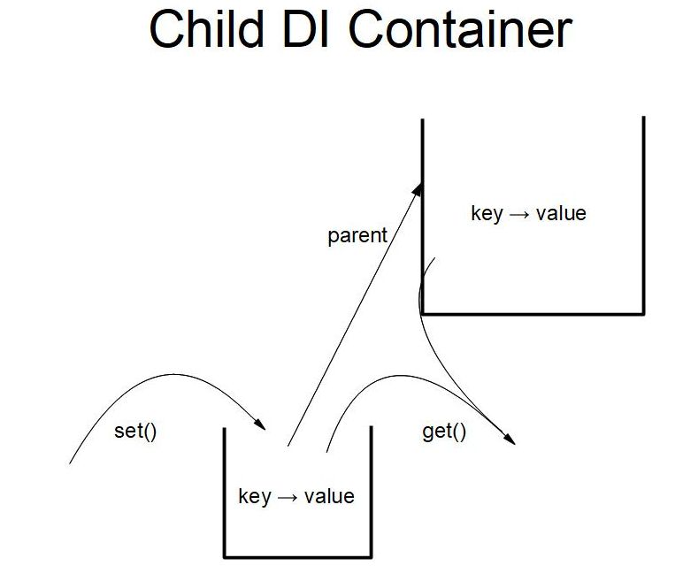

# Extensions and Child Containers
Whenever Joomla boots an extension it creates a child DIC, solely for use of that extension. It's shown diagrammatically below.



The child DIC has a `parent` pointer to the main DIC, and acts similarly to the main DIC, but not exactly:
- Whenever `set()` is called on this child DIC the key-value pair is inserted into the child container.
- Whenever `get()` is called on it, the resource is obtained from the child container, but if it's not found there then the parent container is searched also. 

From Joomla version 4 the Joomla developers are requesting that extension developers use dependency injection for their extensions by defining a services/provider.php file. The loading of an extension is then a two-step process, handled within the services/provider.php file::
1. The extension class is entered into child DIC
2. The extension class is retrieved from the child DIC, creating an instance of the class

Let's look at a minimal example of this for com_example, with namespace Mycompany\Component\Example.
```php
use Joomla\CMS\Extension\ComponentInterface;
use Joomla\DI\Container;
use Joomla\DI\ServiceProviderInterface;
use Mycompany\Component\Example\Administrator\Extension\ExampleComponent;
return new class implements ServiceProviderInterface {
    public function register(Container $container): void 
    {
        $container->set(
            ComponentInterface::class,
            function (Container $container) {
                $component = new ExampleComponent();
                return $component;
            }
        );
    }
};
```
We can see that when Joomla does a `require` of this php file, then it will return a class instance:
```php
$provider = require $path;  // $path points to the relevant services/provider.php file
```
The variable `$provider` then points to an object which is an instance of this anonymous class. Also the class implements `Joomla\DI\ServiceProviderInterface`, which basically means that it has a method called `register` with the above signature.

When next Joomla does 
```php
if ($provider instanceof ServiceProviderInterface) {
    $provider->register($container);
```
the `register` function will be called, which will put into the child DIC an entry with
- key =  ComponentInterface::class – this is just a PHP shorthand way of specifying the string 'Joomla\CMS\Extension\ComponentInterface'
- value = a function which returns a new instance of ExampleComponent, which is the [Extension class](../extension-and-dispatcher/extension-component.md) of `com_example`

Then when  Joomla executes the code:
```php
$extension = $container->get($type);
```
the function above will run and will return a new instance of `ExampleComponent`. 

You can follow through the Joomla code yourself in libraries/src/Extension/ExtensionManagerTrait.php, and confirm that the above pattern also applies to modules and plugins. 

Notice also the following line in that file:
```php
if ($extension instanceof BootableExtensionInterface) {
            $extension->boot($container);
        }
``` 
So if the Extension class implements `BootableExtensionInterface` then Joomla will immediately call the `boot` function of the Extension instance, as described in the [Extension documentation](../extension-and-dispatcher/extension-component.md).