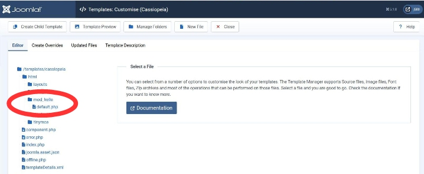

Step 2 Adding a tmpl file
=========================

## Introduction

In this step we add a tmpl file to the module, and introduce the Joomla concepts of template overrides and namespacing. 

The source code is available at [mod_hello step 2](https://github.com/joomla/manual-examples/tree/main/module-tutorial/step2_tmpl_file).

## tmpl file and Template Overrides

We change our simple statement `echo "<h4>Hello</h4>";` to the following:

```php title="mod_hello/mod_hello.php"
<?php
defined('_JEXEC') or die;
// highlight-start
use Joomla\CMS\Helper\ModuleHelper;

$data = "Hello";

require ModuleHelper::getLayoutPath('mod_hello');
// highlight-end
```

And we add in a tmpl subdirectory the file default.php:

```php title="mod_hello/tmpl/default.php"
<?php
defined('_JEXEC') or die;

?>

<h4><?php echo $data; ?></h4>
```

This is a lot more complicated than before! Why do it this way? The answer is that it supports template overrides.

When Joomla outputs HTML like this it separates out into a tmpl file the PHP which is responsible for echoing the HTML elements. 
This then makes it possible for website administrators or developers to change the form of the HTML which is output.

For example, in the case of `mod_hello` an administrator might prefer the HTML output to use `<h3>` tags instead of `<h4>`.

Once this version of `mod_hello` is installed you can go to System / Site Templates and then click on Cassiopeia Details and Files (assuming you're using the default Joomla site template). You can then click on the Create Overrides tab and you should find `mod_hello` in the list of Modules.

Click on `mod_hello` and you should get a message: "Override created in \templates\cassiopeia\html\mod_hello". This is where Joomla has placed a copy of your default.php file, which you should be able to see by expanding the explorer view.



When you click on default.php you will be able to edit the file, and can change the HTML output. (If you decide to try this out then remember to delete the override file afterwards, otherwise it will continue to be used for subsequent steps in the tutorial).

What the line `ModuleHelper::getLayoutPath('mod_hello')` is doing is looking through the possible places in the Joomla file system where an override file might be stored, and only if none is found is the modules/mod_hello/tmpl/default.php file used.

Note also that the `getLayoutPath` function returns the path of the file, and our code does a PHP `require` of this file, so that the default.php code runs in the same PHP function context as the mod_hello.php code. 
This means that any PHP variables assigned in mod_hello.php are available in tmpl/default.php. 

## Namespacing

We've also used here the fact that Joomla code uses [PHP namespacing](https://www.php.net/manual/en/language.namespaces.php): 

```php title="mod_hello/mod_hello.php"
use Joomla\CMS\Helper\ModuleHelper;
...
require ModuleHelper::getLayoutPath('mod_hello');
```

You can read how Joomla implements namespacing in the [namespaces](../../../general-concepts/namespaces/index.md) section. 

In particular the [mapping from Joomla fully-qualified name to source file](../../../general-concepts/namespaces/joomla-namespace-prefixes.md) enables us to find quickly the source of any Joomla class. 
For example \Joomla\CMS\Helper\ModuleHelper is found in libraries/src/Helper/ModuleHelper.php. 

## Manifest file update

As we've introduced a new folder in our set of source files we need to tell the Joomla installer to process it:

```xml title="mod_hello/mod_hello.xml"
<?xml version="1.0" encoding="utf-8"?>
<extension type="module" client="site" method="upgrade">
    <name>Joomla module tutorial</name>
    <!-- highlight-next-line -->
    <version>1.0.2</version>
    <author>me</author>
    <creationDate>today</creationDate>
    <description>Code used in the Joomla module tutorial</description>
    <files>
        <filename module="mod_hello">mod_hello.php</filename>
        <!-- highlight-next-line -->
        <folder>tmpl</folder>
    </files>
</extension>
```

## Installation

When you have made the source files updates you should zip up the mod_hello folder and install the updated module as described in the previous section.
You shouldn't need to specify the publishing status, template position or menu assignment again - Joomla will continue to use what you specified before.

When you redisplay a site page then you should see that the module displays the same as before, but now you can go into the administrator back-end to setup a template override.
