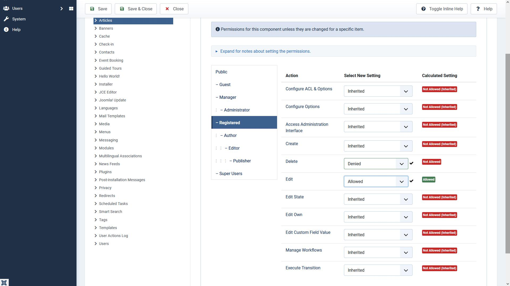
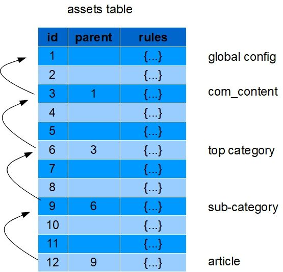

ACL stands for Access Control List.

ACL Access relates to what users can view.

ACL Permissions relate to what users can do. 

Joomla has a very sophisticated permissions framework, and if you're not familiar with it you should view some introductory material first. I'd recommend the [Access Control List Tutorial](https://docs.joomla.org/J3.x:Access_Control_List_Tutorial) and the video [Joomla 3 ACL Explained with Randy Carey](https://www.youtube.com/watch?v=CFqXAc3orkY) (between 2 minutes and 32 minutes is the section to watch). Both of these related to Joomla 3, but ACL hasn't changed between Joomla version 3 and version 4 or 5.

# Permissions - an implementation view
Permissions are held in the Joomla `#__assets` table, in the `rules` column. If you have a clean Joomla install, in the `assets` record for `com_content` (ie the record where the `name` column is "com_content") you'll have an entry in the `rules` column similar to (but probably not exactly the same as):

{"core.admin":{"7":1},"core.manage":{"6":1},"core.create":{"3":1},"core.edit":{"4":1,"2":1},"core.edit.state":{"5":1},"core.execute.transition":{"6":1,"5":1},"core.delete":{"2":0}}

This means that at the `com_content` level:
- For the "core.admin" permission user group "7" has the value 1 (which is *Allowed*)
- For the "core.manage" permission user group "6" has the value 1 (*Allowed*)
- (similarly for the next few permissions)
- For the "core.delete" permission user group "2" has the value 0 (*Denied*)

For these permissions where a user group isn't specified, then this means that the value is *Inherited*.

The values above mirror what is set via the system configuration for Articles (Permissions tab).



The picture shows the permissions for the Registered user group, which on my Joomla instance has usergroup "2". I've set the permissions so that this usergroup's permissions in the JSON string above are:
- "core.edit" - set to 1 - *Allowed*
- "core.delete" - set to 0 - *Denied*
Other permissions are not set, and so these default to *Inherited*. 

# Permission Actions
These are the types of actions which users may perform. Most are self-evident, but some may require a little explanation.  

"**core.admin**" - this is described as "Configure ACL & Options" at the component configuration level and "Super User" at the Global Configuration level. 

A user with "core.admin" permission at a component configuration level, but not at site level may perform any action relating to that component, but the system-wide actions will not be available to him/her. 

A user with "core.admin" permission at the Joomla site level (ie Global Configuration) is completely unrestricted and may perform any action across the site.

"**core.options**" - described as "Configure Options" or "Configure Options Only" (depending upon Joomla version). Determines whether the user can configure the options 
- in the Global Configuration (if the permission is held at global level)
- for an individual component (if the permission is held at a component level).

"**core.manage**" - described as "Access Administration Interface". A user with this permission may access the administrator back-end and perform lower level administration functions such as checking in items. 

# The Asset Hierarchy


As shown in the diagram, assets are held in a hierarchy, implemented as a Nested Set structure in the `#__assets` table. This enables permissions to be set at a higher level, and then for these to ripple down to lower level items. 

For `com_content` the lowest level is the individual article, then going up we have:
- the article's category
- that category's parent (and so on until the topmost parent category)
- com_content permissions
- global configuration permissions

# How Joomla determines if a user may perform an action
Let's consider how Joomla checks if a user may edit an article. Here are the steps (these are the logical steps - the actual is code is designed differently to be more performant):

1. Decide on the permission - let's say in this case that it's "core.edit"
2. Find all the usergroups which the user belongs to. These will comprise the usergroup or usergroups which the user is directly assigned to, plus the ancestors of those usergroups. 
3. Get the permission rules for the article. For example, if the article id is 22, then this involves finding the assets record with name = "com_content.article.22", and looking in the `rules` field.
4. Go up through the assets table (using the `parent` field) and obtain the permission rules for all the ancestors. This goes up through the hierarchy of categories associated with the article, through `com_content` permissions, up to the root permissions set in the Global Configuration. 
5. Look for entries relating to "core.edit" in these sets of rules for each of the usergroups to which the user belongs:
- If a rule is found where one of the user's usergroups is assigned a value 0 (ie Denied) then the user is not allowed to perform the action. A Denied value at any level of the asset hierarchy for any of the usergroups to which the user belongs (directly or indirectly) will mean that the user is not permitted to perform the action.
- If no Denied value is found for any of the user's usergroups then if there's at least one entry for any of the user's usergroups which has a value 1 (Allowed) then the user is permitted to perform the action.
- If there are no entries in any of the asset hierarchy rules for any of the user's usergroups then the user is not permitted to perform the action. 

# Checking Permissions in your Extension
Joomla doesn't magically apply the permission rules to control what users may or may not do within your extension. It's up to you to determine which permission string is appropriate for an action, and call the Joomla library functions to check if the user has permissions to perform that action.

For example, to check if a user may edit an article (with id = 22, say), use:
```php
$user = Factory::getApplication()->getIdentity();
$allowed = $user->authorise('core.edit', 'com_content.article.22');
```
The variable `$allowed` will be set to `true` or `false`, depending upon whether the user is allowed to perform that action or not. 

Or to check if a user may create a contact:
```php
$allowed = $user->authorise('core.create', 'com_contact');
```

If you're wanting to check a number of permissions at the component level (eg for displaying a toolbar in a component view) then you can use:
```php
use Joomla\CMS\Helper\ContentHelper;
…
$canDo = ContentHelper::getActions('com_example');
if ($canDo->get('core.create')) {  // display New button
}
if ($canDo->get('core.delete')) {  // display Delete button
}  // etc
```