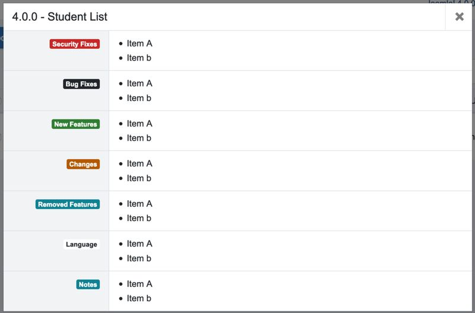

Changelogs
==========

Extension developers can leverage the ability of Joomla to read a changelog file and give a visual representation of the changelog. If a given version is not found in the changelog, the changelog button will not be shown.

The changes in a release are presented in this manner: 



## Displaying the Changelog

Changelogs can be displayed in 2 places within the Joomla administrator back-end.

1. Manage Extensions


You can click on the version number to display the changelog.

To enable this you must specify in the extension installation manifest file where Joomla should look to find the changelog details, for example:

```xml
<changelogurl>https://example.com/updates/changelog.xml</changelogurl>
```

Please note: The URL in the changelogurl tag must not have any spaces or line breaks before or after it.

2. Update Extensions


To enable this you must specify in the extension[ update server](../update-server.md) file where Joomla should look to find the changelog details, for example:

```xml
<changelogurl>https://example.com/updates/changelog.xml</changelogurl>
```

:::note[Joomla Issue]
  This feature does not currently work; see [Joomla issue 43505](https://issues.joomla.org/tracker/joomla-cms/43505).
:::

## The Changelog File

An example of a changelog file is below:

```xml
<changelogs>
    <changelog>
        <element>com_lists</element>
        <type>component</type>
        <version>4.0.0</version>
        <security>
            <item>Item A</item>
            <item>Item b</item>
        </security>
        <fix>
            <item>Item A</item>
            <item>Item b</item>
        </fix>
        <language>
            <item>Item A</item>
            <item>Item b</item>
        </language>
        <addition>
            <item>Item A</item>
            <item>Item b</item>
        </addition>
        <change>
            <item>Item A</item>
            <item>Item b</item>
        </change>
        <remove>
            <item>Item A</item>
            <item>Item b</item>
        </remove>
        <note>
            <item>Item A</item>
            <item>Item b</item>
        </note>
    </changelog>
    <changelog>
        <element>com_lists</element>
        <type>component</type>
        <version>0.0.2</version>
        <security>
            <item>Big issue</item>
        </security>
    </changelog>
</changelogs>
```

You may specify multiple `<changelog>` elements within the `<changelogs>` element, one for each version of the extension.

Each `<changelog>` element must have the following 3 nodes:
- element
- type
- version

This information is used to identify the correct changelog for a given extension, for example:

```xml
<element>com_lists</element>
<type>component</type>
<version>4.0.0</version>
```

The changelog contains one or more change types. The following change types are supported:
- security: Any security issues that have been fixed
- fix: Any bugs that have been fixed
- language: This is for language changes
- addition: Any new features added
- change: Any changes
- remove: Any features removed
- note: Any extra information to inform the user

Each node can be repeated as many times as needed.

The format of the text can be plain text or HTML but in case of HTML, it must be enclosed in CDATA tags as in:

```xml
<security>
    <item><![CDATA[<h2>You MUST replace this file</h2>]]></item>
</security>
```

